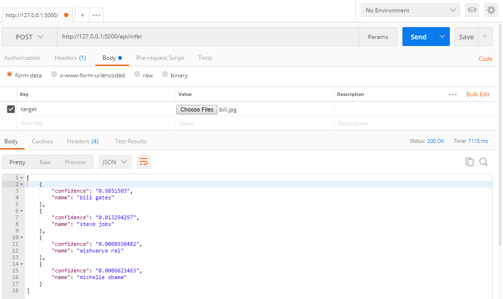

## Create a virtual env
```
pip install --upgrade virtualenv
virtualenv --system-site-packages tensorflow
cd tensorflow
source ./bin/activate
```

To deactivate later:
```
deactivate
```

## Install Tensorflow and friends
```
pip install tensorflow tensorflow_hub
```

## Start retraining
```
python retrain.py --image_dir celeb-photos --logdir logs --saved_model_dir=saved-model
```

## Test inference
```
python label_image.py --graph=/tmp/output_graph.pb --labels=/tmp/output_labels.txt --input_layer=Placeholder --output_layer=final_result --image=bill.jpg
```
## Install Flask and friends
```
pip install flask Flask-Uploads
```

## Host the API
```
python api.py
```

## Test the API
```
POST /infer HTTP/1.1
Host: 127.0.0.1:5000
Cache-Control: no-cache
Postman-Token: 3e108526-8c08-ea9c-393b-ce8b58ee66fb
Content-Type: multipart/form-data; boundary=----WebKitFormBoundary7MA4YWxkTrZu0gW

------WebKitFormBoundary7MA4YWxkTrZu0gW
Content-Disposition: form-data; name="target"; filename="bill.jpg"
Content-Type: image/jpeg


------WebKitFormBoundary7MA4YWxkTrZu0gW--
```
